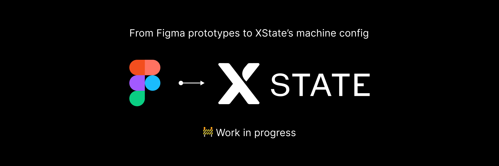

# 🚧 Figma Select and Inspect

More info soon

<!--  -->

<!-- ## Why?

TODO:

## FAQ

TODO: -->

### Install the plugin

1. In the Figma desktop app, open a Figma document.
2. Search for and run `Import plugin from manifest…` via the Quick Actions search bar.
3. Select the `manifest.json` file that was generated by the `build` script.
